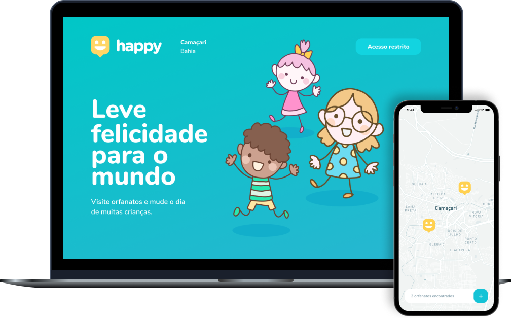

<h1 align="center">
  
</h1>

  
   
  

  

  

  <a href="#-features">Features</a>&nbsp;&nbsp;&nbsp;|&nbsp;&nbsp;&nbsp;
  <a href="#-tecnologias">Tecnologias</a>&nbsp;&nbsp;&nbsp;|&nbsp;&nbsp;&nbsp;
  <a href="#-projeto">Projeto</a>&nbsp;&nbsp;&nbsp;|&nbsp;&nbsp;&nbsp;
  <a href="#-como-contribuir">Como contribuir</a>

 

  

## 📎 Features
- [🛢 Back-end](./server)
- [💻 Front-end](./web)
- [📱 Mobile](./mobile)

## 🚀 Tecnologias

Esse projeto foi desenvolvido com as seguintes tecnologias:

- [Node.js](https://nodejs.org/en/)
- [React](https://reactjs.org)
- [React Native](https://facebook.github.io/react-native/)

## 💻 Projeto

O Happy é uma aplicação que conecta pessoas à casas de acolhimento institucional (orfanatos) para fazer o dia de muitas crianças mais feliz.

Essa aplicação foi construída na trilha <strong>OmniStack</strong> da <strong>Next Level Week #03</strong> distribuída pela [Rocketseat](https://rocketseat.com.br/). A ideia de criar uma aplicação voltada ao ensino surgiu da proximidade da data evento com o <strong>Dia das Crianças</strong>.

## 🤔 Como contribuir

- Faça um fork desse repositório;
- Cria uma branch com a sua feature: `git checkout -b minha-feature`;
- Faça commit das suas alterações: `git commit -m 'feat: Minha nova feature'`;
- Faça push para a sua branch: `git push origin minha-feature`.

Depois que o merge da sua pull request for feito, você pode deletar a sua branch.

---

<h4 align="center">
  Feito com 💙 <a href="https://www.linkedin.com/in/vilsonsampaio/" target="_blank">Vilson Sampaio</a>
</h4>