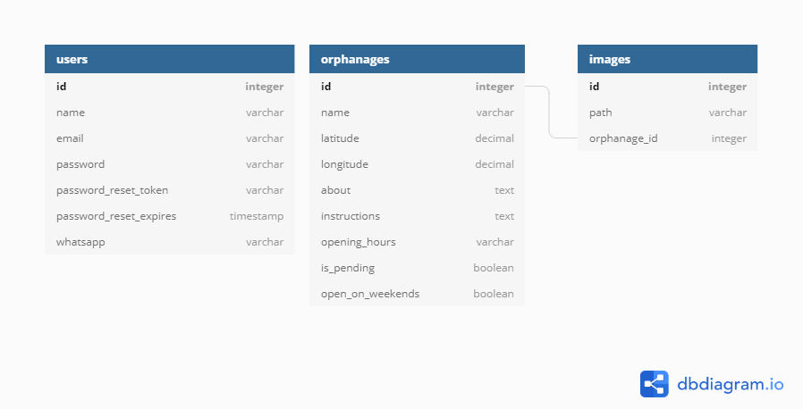

<h1 align="center">
  
</h1>

  
   
  

  

  

  <a href="#-features">Features</a>&nbsp;&nbsp;&nbsp;|&nbsp;&nbsp;&nbsp;
  <a href="#-tecnologias">Tecnologias</a>&nbsp;&nbsp;&nbsp;|&nbsp;&nbsp;&nbsp;
  <a href="#-como-instalar">Como instalar</a>&nbsp;&nbsp;&nbsp;|&nbsp;&nbsp;&nbsp;

 

  

## 📎 Features

- Listagem, criação, atualização e exclusão de orfanatos
- Entrar, cadastrar e alterar senha no sistema

 

<a href="https://dbdiagram.io/d/5f8794653a78976d7b77b02c">Clique aqui para ver o model do banco de dados</a>

## 🚀 Tecnologias

Esse projeto foi desenvolvido com as seguintes tecnologias:

- [TypeScript](https://www.typescriptlang.org/)
- [Node.js](https://nodejs.org/en/)
- [bcrypt.js](https://yarnpkg.com/package/bcryptjs)
- [CORS](https://yarnpkg.com/package/cors)
- [dotenv](https://yarnpkg.com/package/dotenv)
- [Express](https://expressjs.com/)
- [JSON Web Token](https://jwt.io/)
- [Multer](https://yarnpkg.com/package/multer)
- [NodeMailer](https://nodemailer.com/about/)
- [SQLite](https://www.sqlite.org/index.html)
- [TypeORM](https://typeorm.io/#/)
- [Yup](https://yarnpkg.com/package/yup)

## 💾 Como instalar

1. Primeiro, é necessário que tenha instalado em seu computador o [NodeJS](https://nodejs.org/en/docs/) e o [Yarn](https://yarnpkg.com/getting-started). Após a instalação dos mesmos, clone esse repositório com o seguinte comando no terminal: `git clone https://github.com/vilsonsampaio/happy`.

3. Navegue para a pasta `server/` do diretório criado através do clone: `cd happy/server`.

4. Dentro da pasta web, instale as dependências necessárias usando: `yarn` ou `yarn add`.

5. Na sua IDE, abra a pasta `src/` e em seguida abra o arquivo `.env.example`. Dentro dele, procure pela variável de ambiente de nome `JWT_SECRET` e insira ali um nome para a secret do JSON Web Token. 

6. Em seguida, preencha as variáveis `NODEMAILER_HOST`, `NODEMAILER_PORT`, `NODEMAILER_USER` e `NODEMAILER_PASS`, definindo ali os valores de configuração para o envio e-mails. Para testar o recebimento dos e-mails, utilizei o [Mailtrap](https://mailtrap.io/).
   
7. Defina também na variável de nome `FRONTEND_URL` o endereço para o front-end da aplicação, que, por padrão, é `http://localhost:3000`.

8. Após preencher todas as variáveis, renomeie o arquivo `.env.example` para `.env`.

9. No terminal, execute o comando `yarn typeorm migration:run` a fim de executar as migrations e criar o banco de dados.

10. Tudo pronto? Agora é só rodar a aplicação com o comando `yarn dev` que o servidor já estará funcionado no endereço `http://localhost:3333/`.

---

<h4 align="center">
  Feito com 💙 <a href="https://www.linkedin.com/in/vilsonsampaio/" target="_blank">Vilson Sampaio</a>
</h4>
