<h1 align="center">
  
</h1>

  
   
  

  

  

  <a href="#-features">Features</a>&nbsp;&nbsp;&nbsp;|&nbsp;&nbsp;&nbsp;
  <a href="#-tecnologias">Tecnologias</a>&nbsp;&nbsp;&nbsp;|&nbsp;&nbsp;&nbsp;
  <a href="#-como-instalar">Como instalar</a>&nbsp;&nbsp;&nbsp;|&nbsp;&nbsp;&nbsp;
  <a href="#-projeto-final">Projeto final</a>

 

  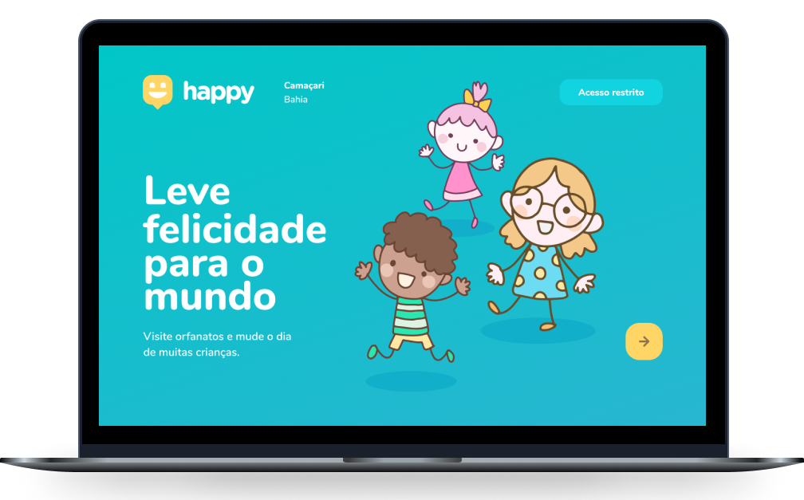

## 📎 Features

- Cadastrar e visualizar orfanatos
- Gerenciar orfanatos (Administrador)

## 🚀 Tecnologias

Esse projeto foi desenvolvido com as seguintes tecnologias:

- [TypeScript](https://www.typescriptlang.org/)
- [React](https://reactjs.org)
- [React Router DOM](https://reactrouter.com/web/guides/quick-start)
- [Axios](https://github.com/axios/axios)
- [Leaflet](https://leafletjs.com/)
- [React Leaflet](https://react-leaflet.js.org/)
- [React Icons](https://react-icons.github.io/react-icons/)
- [React Toastify](https://fkhadra.github.io/react-toastify/introduction)
- [Styled Components](https://styled-components.com/)

## 💾 Como instalar

1. Primeiro, é necessário que tenha instalado em seu computador o [NodeJS](https://nodejs.org/en/docs/) e o [Yarn](https://yarnpkg.com/getting-started). Após a instalação dos mesmos, clone esse repositório com o seguinte comando no terminal: `git clone https://github.com/vilsonsampaio/happy`.

2. Para cadastrar e obter os dados da base de dados, é necessário instalar primeiro o back-end da aplicação. Para isso, [clique aqui]('../server/') para ser levado para um guia contendo as instruções de instalação.

3. Navegue para a pasta `web/` do diretório criado através do clone: `cd happy/web`.

4. Dentro da pasta web, instale as dependências necessárias usando: `yarn` ou `yarn add`.

5. Na sua IDE, abra a pasta `src/` e em seguida abra o arquivo `.env.example`. Dentro dele, procure pela variável de ambiente de nome `REACT_APP_MAPBOX_TOKEN` e insira ali o token obtido por meio do cadastro no site da [Mapbox](https://account.mapbox.com/auth/signin/). Após preencher a variável, renomeie o arquivo `.env.example` para `.env`.

6. Tudo pronto? Agora é só rodar a aplicação `yarn start` e abrir o endereço `http://localhost:3000/` em seu navegador.

## 🌐 Projeto final

### Landing
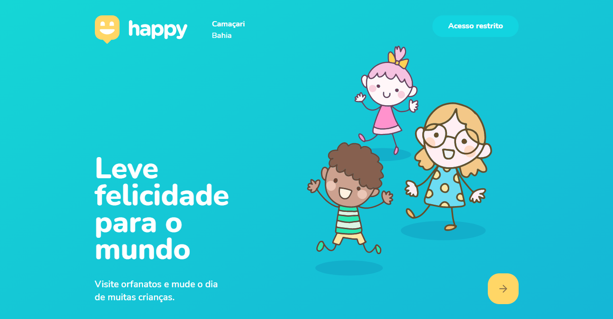

### Ver orfanatos
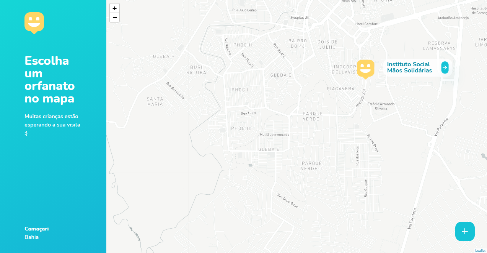

### Cadastrar orfanato
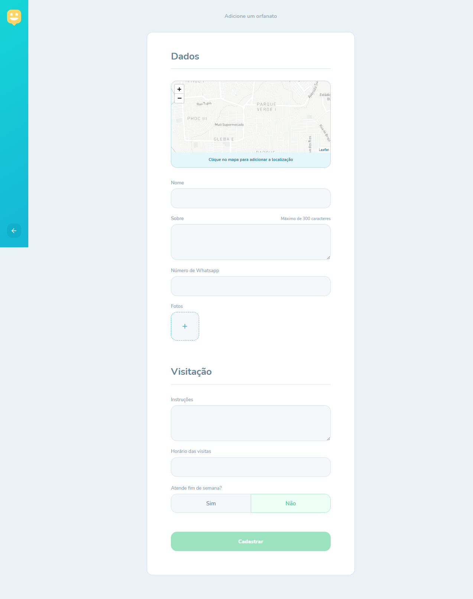

### Detalhe de um orfanato
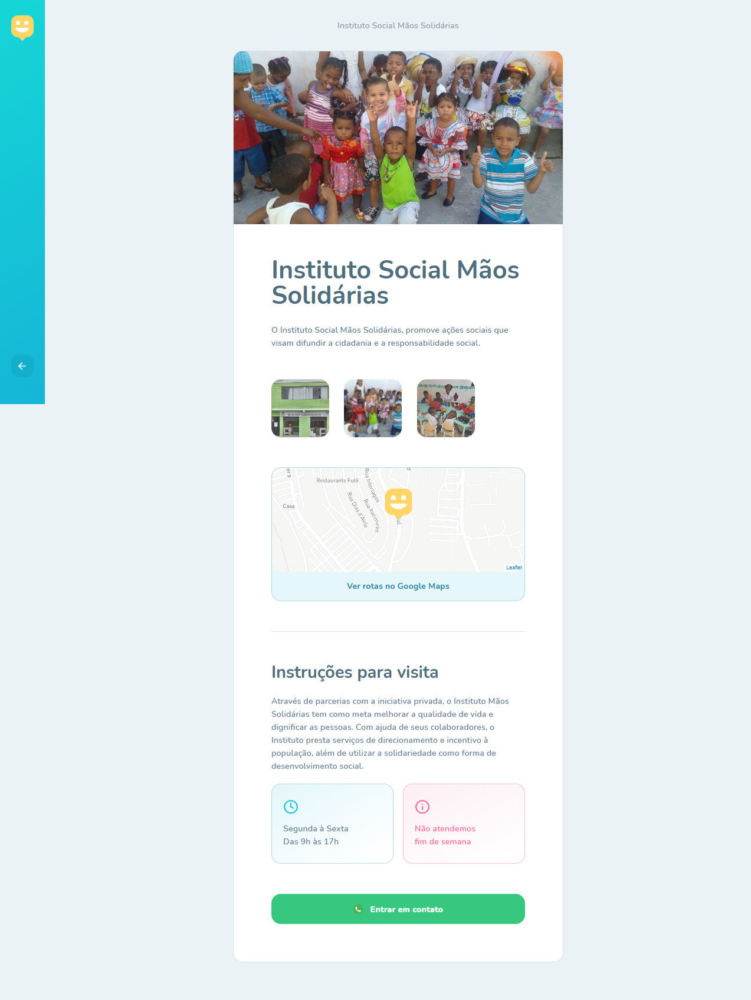

### Fazer login
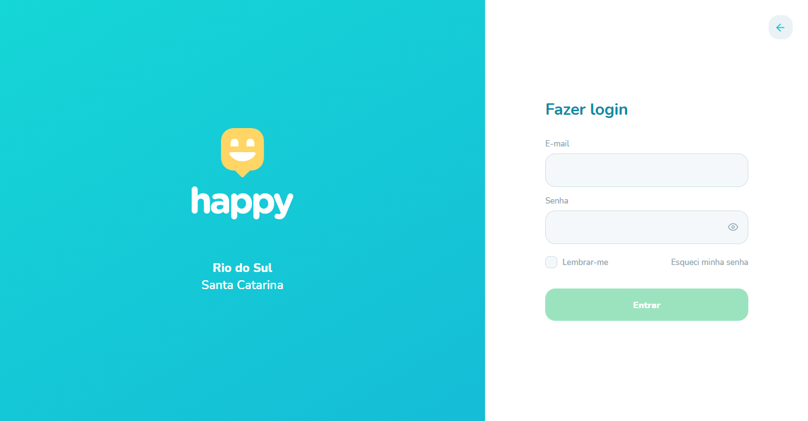

### Esqueci a senha
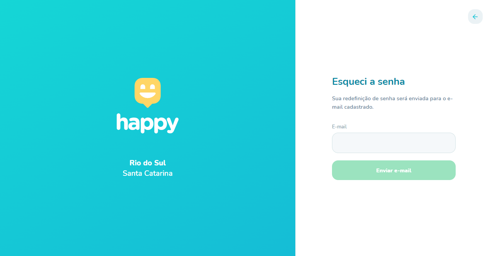

### Resetar senha
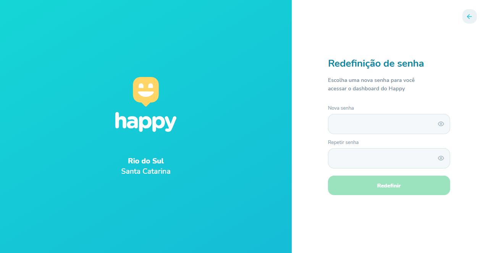

### Dashboard (aprovados)
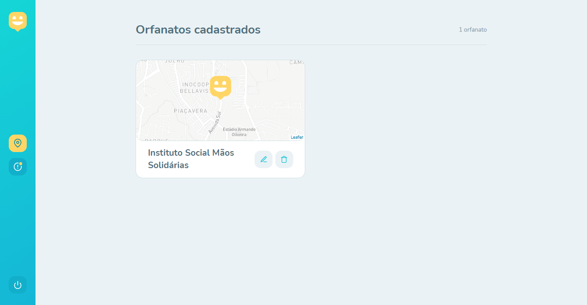

### Editar orfanato já aprovado
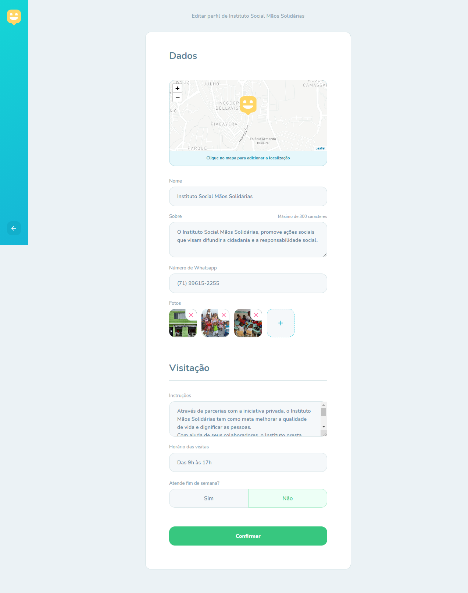

### Dashboard (pendentes)
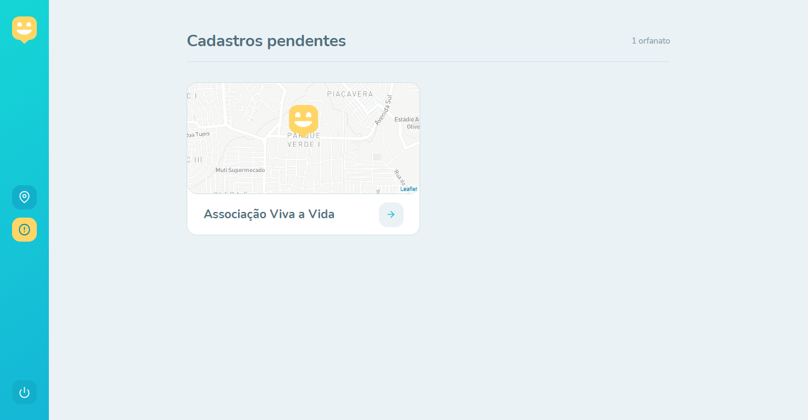

### Editar orfanato pendente

### Página de Sucesso

### Pagina de Confirmar Exclusão

---

<h4 align="center">
  Feito com 💙 <a href="https://www.linkedin.com/in/vilsonsampaio/" target="_blank">Vilson Sampaio</a>
</h4>
